# 微信云开发

# 【农产品销售信息平台】

### 需求背景

目前的农民收入中，经营性收入占30%多一点，务工收入占45%左右，家庭经营收入主要靠农产品销售，通过电商销售农产品成为农民增收的一个亮点。在实际电商销售过程中，对于农产品的规模、物流、品控都有较高的标准和要求，这对于一般农户、或者刚起步的创业者来说很困难。希望有一些结合当地旅游、美食相关的小程序，让游客查询到当地土特农产品，去到原产地边游玩边购买；也可以填写在当地临时住址，方便农户们送货上门。

### 主要功能

- [x] 商品主页，商品列表可以浏览商品，点击列表中的商品可跳转至商品详情页，点击导航栏可以跳转购物车、我的等页面，搜索栏
- [x] 商品详情页展示商品图片、价格，可以选择规格、数量并添加至购物车，可以点击客服、购物车
- [x] 购物车功能，可以修改商品数量，删除商品，可以全选或者取消全选，每次更改都可以计算商品价格，可以提交订单，进入下单页面
- [x] 下单功能，在购物车提交订单跳转至下单页面，可以添加地址，查看购买商品列表，计算总价，添加备注，最后下单
- [x] 查看订单功能，可以分类别查看已付款、运输中、已完成订单
- [x] 登录功能，支持用户一键注册登录
- [x] 个人主页，可以查看各类别订单，修改地址等，可以登录后台
- [ ] 简单管理端实现，可上传商品，实现商品管理
- [ ] 简单售后功能
- [ ] 简单搜索功能
- [ ] 支持商品分类
- [ ] 支持商品评价功能

### 技术方法

- 前端：js+css+html
- 后端：微信云开发
- 具体可在产品实现说明中查看

### 使用

- 源码运行：下载[demo1](https://github.com/guanyiming-20000218/kotlin-android-2022/tree/main/demo1)，打开微信小程序导入，将appid改为您的小程序id，编译运行
- appid查看：appid为 wxdbff1a7251f1f895
- 手机端查看：扫描二维码查看

## 用例图

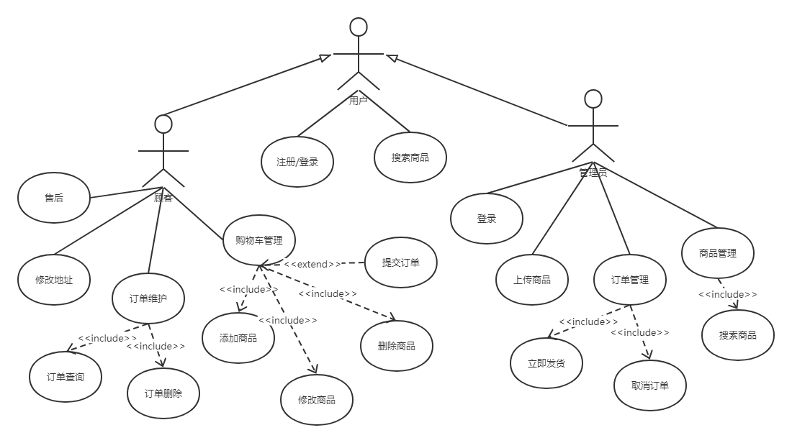

### 用例描述

| **用例名称**：用户注册/登录                                  |
| ------------------------------------------------------------ |
| **参与者**：用户                                             |
| **简要说明**：  用户一键注册登录                             |
| **前置条件：**  用户同意注册登录                             |
| **基本事件流：**  1．用户进入我的页面 2．弹窗提示是否允许注册登录  3．用户注册登录成功 4.用例终止 |
| **后置条件**：  获得用户微信信息                             |
| **注释：**无                                                 |

| **用例名称**：添加商品                                       |
| ------------------------------------------------------------ |
| **参与者**：顾客                                             |
| **简要说明**：  顾客选择想要的商品添加至购物车               |
| **前置条件：**  顾客已注册登录                               |
| **基本事件流：**  1．顾客选择商品规格，数量 2．顾客点击加入购物车  3．顾客加入成功 4.用例终止 |
| **后置条件**：  商品添加至购物车页面                         |
| **注释：**无                                                 |

| **用例名称**：删除商品                                       |
| ------------------------------------------------------------ |
| **参与者**：顾客                                             |
| **简要说明**：  顾客删除购物车的商品                         |
| **前置条件：**  顾客已注册登录                               |
| **基本事件流：**  1．顾客长按商品 2．出现信息框，询问是否删除  3．点击删除，则商品从购物车中删除  4.用例终止 |
| **后置条件**：  商品从购物车中删除                           |
| **注释：**无                                                 |

| **用例名称**：提交订单                                       |
| ------------------------------------------------------------ |
| **参与者**：顾客                                             |
| **简要说明**：  顾客提交购物车或者直接购买的商品订单         |
| **前置条件：**  顾客已注册登录                               |
| **基本事件流：**  1．顾客点击提交或者购买按钮 2．跳转至下单页面  3．顾客添加地址备注等 4.点击提交  4.用例终止 |
| **后置条件**：  订单添加至订单页面                           |
| **注释：**无                                                 |

| **用例名称**：管理员注册/登录                                |
| ------------------------------------------------------------ |
| **参与者**：管理员                                           |
| **简要说明**：  管理员通过账号密码登录                       |
| **前置条件：**  进行用户登录                                 |
| **基本事件流：**  1．管理员点击后台登录 2．弹窗提示输入账号密码  3．管理员登录成功 4.用例终止 |
| **后置条件**：  无                                           |
| **注释：**无                                                 |

| **用例名称**：管理员上传商品                                 |
| ------------------------------------------------------------ |
| **参与者**：管理员                                           |
| **简要说明**：  管理员点击上传商品进行商品上传               |
| **前置条件：**  进行管理员登录                               |
| **基本事件流：**  1．管理员点击上传商品  2.出现上传商品页面  3．管理员输入商品信息，点击提交 4.用例终止 |
| **后置条件**：  商品添加至商品首页的商品列表                 |
| **注释：**无                                                 |

## 时序图

### 1.添加商品到购物车

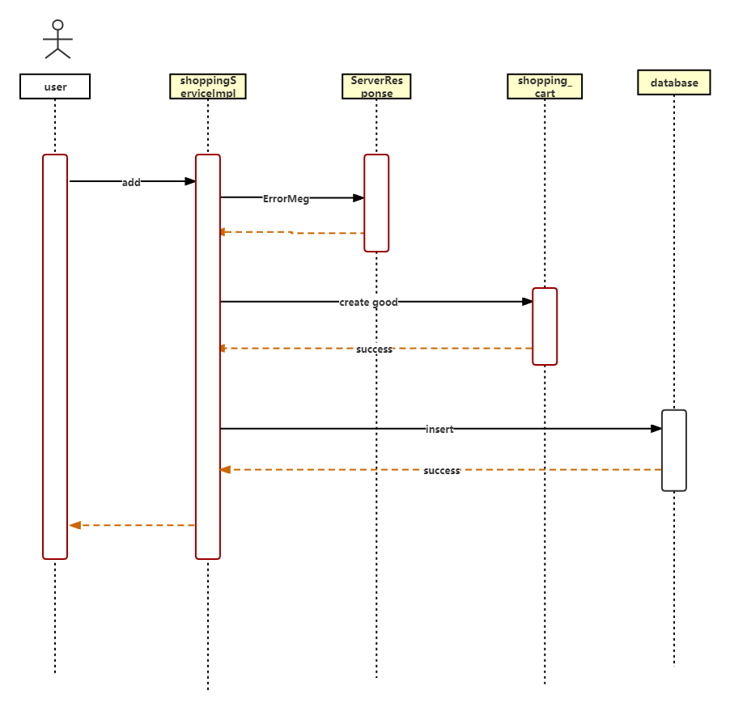

### 2.购物车删除商品

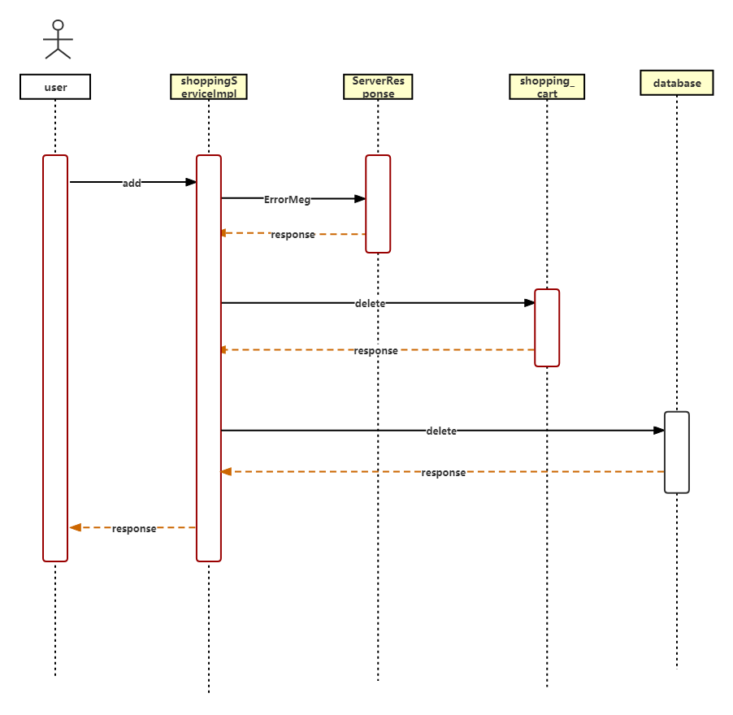

## 产品实现说明

### 1.商城首页

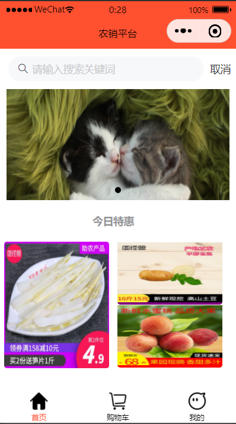

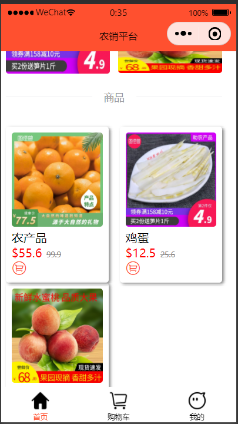

说明：

1.搜索框，引入Vant组件实现

```
<van-search value="{{ value }}" input-align="center" placeholder="请输入搜索关键词"/>
```

2.轮播图，调用API swiper 实现，在swiper内实现一个block块，通过for循环调用云数据库中的swiper并展示

```
        <swiper class="swp_a" autoplay="true" circular="true" indicator-dots="true">
            <block wx:for="{{swaper}}" wx:key="index">
                <swiper-item>
                    <image src="{{item.src}}"></image>
                </swiper-item>
            </block>
        </swiper>
```

3.今日特惠，使用image链接云存储中的图片并展示

4.商品列表，在block块使用for循环遍历云数据库中的product，并返回图片、商品名称、商品价格等信息，使用navigator链接到商品详情页

```
<block wx:for="{{pro_list}}" wx:key="index">
                <navigator class="pro_detail" url="../product_detail/product_detail?id={{item._id}}">
                    <view style="width: 100%;">
                        <image src="{{item.img[0]}}" class="pro_img"></image>
                        <view>
                            <text>{{item.name}}</text>
                        </view>
                        <view>
                            <view>
                                <text style="color: red;">${{item.price}}</text>
                                <text style="color: #888;font-size: 25rpx;margin-left: 15rpx;text-decoration: line-through;">{{item.h_price}}</text>
                            </view>
                            <van-icon name="cart-circle-o" size="50rpx" color="#FF502F"/>
                        </view>                    
                    </view>
                </navigator>
            </block>
```

5.导航栏，在app.json中用API tobBar实现导航，并为每个图标设置选中与未选中两个状态，调用change选择

```
    onChange(event) {
        this.setData({ active: event.detail });
    },
```

### 2.商品详情页

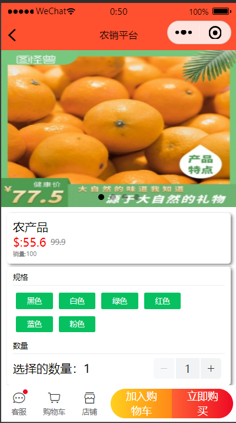

1.轮播图，调用API swiper 实现，在swiper内实现一个block块，通过for循环调用云数据库中的swiper并展示

2.商品信息展示，调用云数据库中的product获取商品名称、价格、销量等信息

3.选择规格，通过wx:for获取云数据库中product的规格字段并展示，并设置选择事件，将数值传给后端函数

```
        <view class="lay_row_sta">
            <text style="font-size: 25rpx;">规格</text>
        </view>
        <van-divider style="width: 100%;" custom-style="margin-top:10rpx;margin-bottom:10rpx;"/>
        <view class="lay_row_sta pro_specs">
            <block wx:for="{{product.specs}}" wx:key="index">
                <van-button wx:if="{{item != select_specs}}"  type="primary" size="mini" style="margin: 10rpx;" bind:click="select_specs" data-specs="{{item}}">{{item}}</van-button>
                <van-button wx:else type="danger" size="mini" style="margin: 10rpx;" bind:click="select_specs" data-specs="{{item}}">{{item}}</van-button>
            </block>
        </view>
```

4.选择数量，引用Vant组件van-stepper，默认为1，设置bind:change事件，将值传给后端

```
        <view class="lay_row_spa">
            <text>选择的数量：{{select_num}}</text>
            <van-stepper value="{{ select_num }}" bind:change="select_num" style="margin-left: 200rpx;"/>
        </view>
```

5.底部购物栏，引用Vant组件van-goods-action，并设置点击事件

```
<van-goods-action custom-class="">
  <van-goods-action-icon icon="chat-o" text="客服" dot open-type="contact"/>
  <van-goods-action-icon icon="cart-o" text="购物车" bind:tap="to_shopping_car"/>
  <van-goods-action-icon icon="shop-o" text="店铺" />
  <van-goods-action-button text="加入购物车" type="warning" bind:click="add_shopping_car"/>
  <van-goods-action-button text="立即购买" bind:click="add_order" bind:click="add_order"/>
</van-goods-action>
```

- 点击客服可跳转至官方给出的客服
- 点击购物车链接到购物车页面
- 点击加入购物车，则调用add_shopping_car函数，将前面的选择信息生成一个购物车商品，加入云数据库中的shopping_car
- 点击立即购买，则调用add_order函数，将前面的选择信息生成订单，加入云数据库中的order

### 3.购物车页面

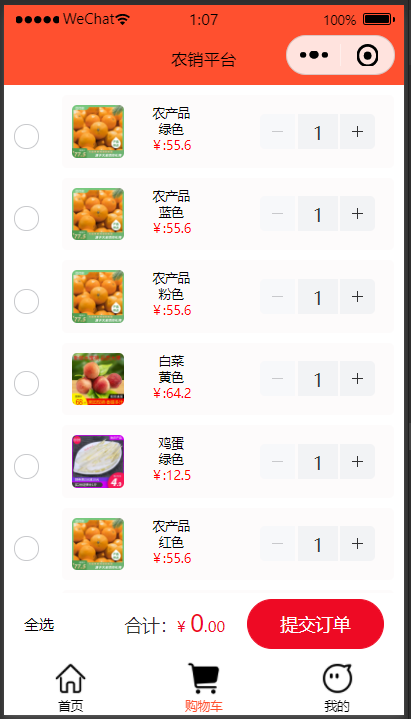

1.购物车列表，从数据库中获取product的信息，通过wx:for循环展示全部

2.每个商品前有一个Vant引入的单选框，绑定选择事件，将选择情况传给后端，并重新计算总价.同时，每一个商品有数量选择框，绑定一个bind:change事件将商品数量传给后端，并重新计算总价

```
<van-checkbox-group value="{{ result }}" bind:change="select_product" style="width: 100%;">
        <block wx:for="{{product_list}}" wx:key="index">
            <view class="lay_row_spa">
                <van-checkbox name="{{index}}">
                </van-checkbox>
                <view class="lay_row_spa pad_20 product_case" style="margin-left: 20rpx;" data-id="{{item._id}}" bindlongpress="delete_product">
                    <view class="lay_row_sta" style="width: 60%;">
                        <image src="{{item.product_img}}" class="product_img"></image>
                        <view class="lay_col_spa" style="width: 50%;height: 100rpx;font-size: 25rpx;">
                            <text>{{item.product_name}}</text>
                            <text>{{item.product_specs}}</text>
                            <text style="color: red;">￥:{{item.product_price}}</text>
                        </view>
                    </view>
                    <van-stepper value="{{ item.product_name }}" data-index="{{index}}" bind:change="select_product_num"/>
                </view>            
            </view>
        </block>
    </van-checkbox-group>
```

3.提交栏，包括是否全选、计算总价、提交订单等，其中通过wx:if判断是否进行全选，并绑定全选事件，重新计算总价。

```
<van-submit-bar
  price="{{ all_price }}"
  button-text="提交订单"
  bind:submit="submit_order"
  tip="{{ true }}"
>
  <van-tag type="primary" wx:if="{{!is_all}}" data-name="全选" bindtap="select_all" style="font-size: 30rpx;">全选</van-tag>
  <van-tag type="primary" wx:else data-name="取消全选" bindtap="select_all" style="font-size: 30rpx;">取消全选</van-tag>
</van-submit-bar>
```

4.计算总价，利用当前页面选择的信息进行总价的计算

```
    // 计算总价
    get_all_price(pro){
        let that=this
        let all_price=0
        let product_list=that.data.product_list
        if(pro.length==0){
            that.setData({
                all_price:0
            })
        }else{
            for(let i=0;i<pro.length;i++){
                let index = parseInt(pro[i])
                all_price = all_price + (product_list[index].product_num*product_list[index].product_price)
                if(i+1==pro.length){
                    that.setData({
                        all_price:parseFloat((all_price*100).toFixed(2))
                    })
                }
            }
        }
    }
```

5.提交订单，需要把购物车中的信息通过API wx.setStorage缓存传给订单页面，通过wx.navigateTo导航至订单页面

```
    submit_order(){
        let that = this
        if(that.data.result.length != 0){
            wx.showLoading({
              title: '提交中',
            })
            let goods = []
            for(let i=0;i < that.data.result.length;i++){
                goods.push(that.data.product_list[that.data.result[i]*i])
                if(i+1==that.data.result.length){
                    wx.hideLoading()
                    wx.setStorage({
                        key:"goods",
                        data:goods
                    })
                    wx.navigateTo({
                        url: '../add_order/add_order',
                    })
                }
            }
        }else{
            wx.showToast({
              title: '请选择商品',
              icon:"none"
            })
        }
    }
```

6.删除商品，长按商品进行删除，通过界面交互API  wx.showModal实现，在确定删除后，操作数据库删除该商品

```
    // 删除商品
    delete_product(e){
        let that = this
        let id = e.currentTarget.dataset.id
        wx.showModal({
          title: '提示',
          content: '是否删除该商品',
          success(res){
              if(res.confirm){
                  console.log('用户点击确定')
                  wx.showLoading({
                    title: '删除中',
                  })
                  db.collection('shopping_car').doc(id).remove().then(res=>{
                    wx.hideLoading()
                    wx.showToast({
                      title: '删除成功',
                    })
                    that.get_shopping_car()
                })
              }else if(res.cancel){
                console.log('用户点击取消')
              }
          }
        })
    }
```

### 4.下单页面

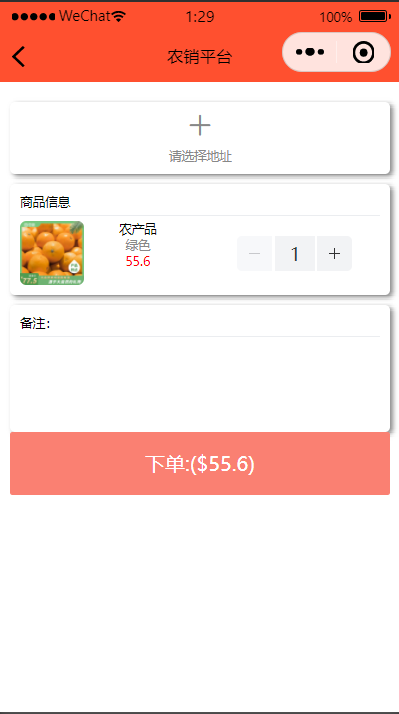

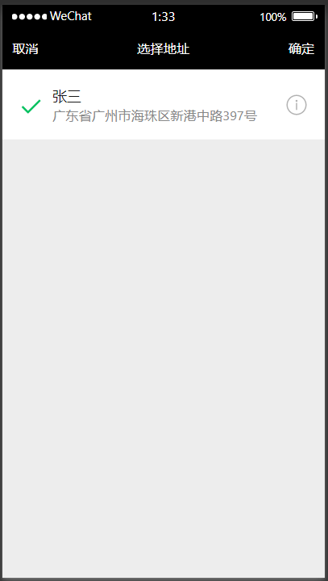

1.添加地址，绑定bindtap事件，在后端通过API wx.chooseAddress获取，进入添加地址页面

```
    // 我的地址
    get_address(){
        let that = this
        wx.chooseAddress({
            success (res) {
              console.log('我的地址',res)
              that.setData({
                  address:res
              })
            }
          })
    },
```

2.商品信息，通过API wx.getStorage获取从购物车页面传来的商品信息，通过wx:for循环展示，在商品信息中可以增减数量并计算总价

```
    //获取商品
    get_goods(){
        let that = this
        wx.getStorage({
            key: 'goods',
            success (res) {
              console.log('获取到的商品',res.data)
              that.setData({
                  goods:res.data
              })
              that.get_all_price(res.data)
            }
        })
    },
```

3.备注，通过textarea实现，绑定事件，将内容传送给后端

```
    <!-- 备注 -->
    <view class="lay_col_cen pad_20 address_case">
        <view class="lay_row_sta">
            <text>备注：</text>
        </view>
        <van-divider style="width: 100%;" custom-style="margin-top:10rpx;margin-bottom:10rpx"/>
        <textarea name="" id="" cols="30" rows="10" style="width: 100%;height: 150rpx;" bindinput="input_remarks"></textarea>
    </view>
```

4.下单，下单前需要计算总价，和购物车类似，不再赘述。下单后，将数据传给数据库的order，并添加类型为“已付款”方便以后查看，下单成功后用wx.removeStorage移除缓存

```
    //下单事件
    add_order(){
        let that = this
        if(that.data.address=="" || that.data.goods.length == 0){
            wx.showToast({
              title: '请填写信息',
              icon:"none"
            })
        }else{
            wx.showLoading({
              title: '下单中',
            })

            db.collection('order').add({
                data:{
                    address:that.data.address,
                    goods:that.data.goods,
                    remarks:that.data.remarks,
                    all_price:that.data.all_price,
                    type:"已付款",
                    time:db.serverDate()
                }
            }).then(res=>{
                wx.hideLoading()
                wx.showToast({
                  title: '下单成功',
                })
                wx.removeStorage({
                  key: 'goods',
                  success(res){
                    wx.navigateBack({
                        delta: 1,
                    })
                  }
                })
                console.log('下单成功',res)
            }).catch(err=>{
                wx.showLoading({
                    title: '下单失败',
                    icon:"error"
                })
                console.log('下单失败',err)
            })
        }
    },
```

### 5.我的页面

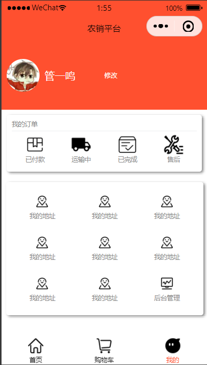

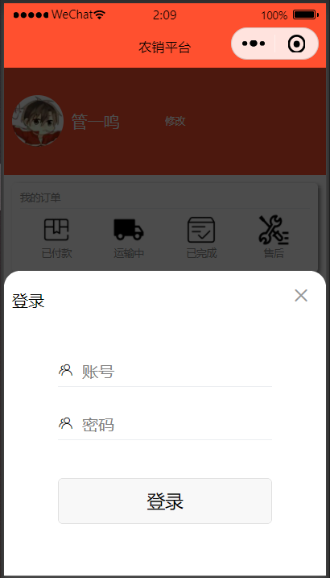

1.个人信息，从数据库中获取user里的用户信息并展示头像、昵称等信息

2.用户注册登录，利用API  wx.getUserProfile一键获取微信用户信息实现注册登录，每次进入该页面会加载注册登录函数

```
// 注册
    register(e){
        let that = this
        wx.showModal({
            title: '提示',
            content: '您还未注册，是否注册',
            success(res){
                if(res.confirm){
                    console.log('用户点击确定')
                    wx.showLoading({
                      title: '注册中',
                    })
                    wx.getUserProfile({
                        desc: '用于完善会员资料', // 声明获取用户个人信息后的用途，后续会展示在弹窗中，请谨慎填写
                        success: (userInfo) => {
                            db.collection('user').add({
                                data:{
                                    userInfo:userInfo.userInfo
                                }
                            }).then(user=>{
                                wx.hideLoading()
                                wx.showToast({
                                  title: '注册成功',
                                })
                                that.login()
                            })
                        }
                    })
                }else if(res.cancel){
                  console.log('用户点击取消')
                }
            }
        })
    },
```

3.订单查看，可以点击已付款、运输中进入订单页面

4.后台管理员登录，Vant引入van-popup弹窗功能，通过input输入账号密码，在数据库中查询，若成功则登入，进入后台页面

```
<!-- wxss页面 -->
<!-- 登录弹窗 -->
<van-popup show="{{ show_login }}" round closeable position="bottom" custom-style="height: 60%" 
bind:close="close_login_case">
    <view class="lay_col_sta pad_20">
        <view class="lay_row_cen" style="height: 100rpx;">
            <text>登录</text>
        </view>
        <view class="lay_row_sta" style="width: 70%;margin-top: 90rpx;">
            <van-icon name="friends-o" />
            <input type="text" placeholder="账号" style="margin-left: 20rpx;" data-name="username" bindinput="input_msg"/>
        </view>
        <van-divider style="width: 70%;" custom-style="margin-top:10rpx;margin-bottom:10rpx;"/>
        <view class="lay_row_sta" style="width: 70%;margin-top: 50rpx;">
            <van-icon name="friends-o" />
            <input type="password" placeholder="密码" style="margin-left: 20rpx;" data-name="password" bindinput="input_msg"/>
        </view>
        <van-divider style="width: 70%;" custom-style="margin-top:10rpx;margin-bottom:10rpx;"/>
        <button style="width: 70%;margin-top: 80rpx;" bindtap="login_admin" disabled="{{is_login?'true':''}}">登录</button>
    </view>
</van-popup>
```

```
// js页面
// 后台登录
    login_admin(){
        let that = this
        wx.showLoading({
            title: '登录中',
          })
        if(that.data.username == '' || that.data.password == ''){
            wx.showToast({
              title: '请输入账号或密码',
              icon:"none"
            })
        }
        else{
            that.setData({
                is_login:true
            })
            db.collection('admin').where({
                username:that.data.username,
                password:that.data.password,
            }).get().then(res=>{
                console.log('登录',res)
                that.setData({
                    is_login:false
                })
                wx.hideLoading()
                if(res.data.length==0){
                    wx.showToast({
                      title: '账号或密码错误',
                    })
                }else{
                    app.globalData.admin=res.data[0]
                    wx.navigateTo({
                      url: '../admin_index/admin_index',
                    })
                }
            })
        }
    },
```

### 6.订单页面

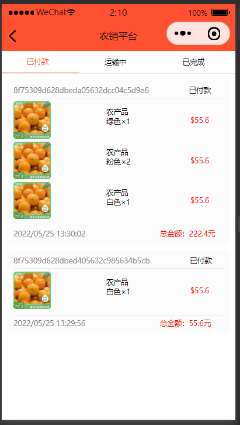

1.头部导航，分为已付款、运输中、已完成，绑定事件进行订单类型的选择，每次点击传入订单类型的名称，并调取获取订单函数获得不同类型的订单

```
<!-- 头部 -->
<view class="lay_row_spa head">
    <view class="lay_row_cen {{title=='已付款'?'select_tile':''}}" data-name="已付款" bindtap="select_title">
        <text style="margin-left: 80rpx;">已付款</text>
    </view>
    <view class="lay_row_cen {{title=='运输中'?'select_tile':''}}" data-name="运输中" bindtap="select_title">
        <text style="margin-left: 80rpx;">运输中</text>
    </view>
    <view class="lay_row_cen {{title=='已完成'?'select_tile':''}}" data-name="已完成" bindtap="select_title">
        <text style="margin-left: 80rpx;">已完成</text>
    </view>
</view>
```

```
    // 选择订单类型
    select_title(e){
        let that = this
        let name = e.currentTarget.dataset.name
        that.setData({
            title:name
        })
    },
```

2.获取不同类型订单并展示，get_order函数通过选择的订单类型在数据库中进行选择，并通过orderBy进行时间排序，时间戳通过utils中的time函数转化为“xxxx-xx-xx xx:xx:xx”格式，在wxss中通过wx:for遍历数据并展示

```
    // 获取订单
    get_order(type){
        let that = this
        wx.showLoading({
          title: '获取订单中',
        })
        db.collection('order').where({
            type:type
        }).orderBy('time','desc').get().then(res=>{
            wx.hideLoading()
            that.setData({
                order:that.change_time(res.data)

            })
            console.log('获取订单成功',res.data)
        }).catch(err=>{
            wx.hideLoading()
            console.log('获取订单成功',err)
        })
    },
```

### 7.后台页面


## 迭代四

### 完成功能

- [x] 简单管理端实现，可上传商品，实现商品管理

### 演示

截图演示：见产品说明实现

二维码查看：


若二维码失效，请联系开发者，邮箱为2818067461@qq.com

## 迭代三

### 完成功能

- [x] 查看订单功能，可以分类别查看已付款、运输中、已完成订单
- [x] 登录功能，支持用户一键注册登录
- [x] 个人主页，可以查看各类别订单，修改地址等，可以选择登录后台，进入后台管理

### 演示

截图演示：见产品说明实现

二维码查看：


若二维码失效，请联系开发者，邮箱为2818067461@qq.com

## 迭代二

### 完成功能

- [x] 购物车功能，可以修改商品数量，删除商品，可以全选或者取消全选，每次更改都可以计算商品价格，可以提交订单，进入下单页面
- [x] 下单功能，在购物车提交订单跳转至下单页面，可以添加地址，查看购买商品列表，计算总价，最后下单

### 演示

视频演示：[迭代2演示.mp4](https://github.com/guanyiming-20000218/kotlin-android-2022/blob/main/迭代2演示.mp4)

二维码查看：[迭代2二维码.jpg](https://github.com/guanyiming-20000218/kotlin-android-2022/blob/main/迭代2二维码.jpg)

若二维码失效，请联系开发者，邮箱为2818067461@qq.com

## 迭代一

### 完成功能

- [x] 商品主页，今日商品推荐，商品列表可以浏览商品，点击列表中的商品可跳转至商品详情页，点击导航栏可以跳转购物车、我的等页面，搜索栏
- [x] 商品详情页展示商品图片、价格、详情等内容，可以选择规格、数量并添加至购物车，可以点击客服、购物车

### 演示

视频演示：[迭代1演示.mp4](https://github.com/guanyiming-20000218/kotlin-android-2022/blob/main/迭代1演示.mp4)

二维码查看：[迭代1二维码.jpg](https://github.com/guanyiming-20000218/kotlin-android-2022/blob/main/迭代1二维码.jpg)

若二维码失效，请联系开发者，邮箱为2818067461@qq.com

## 开发进度表

### 2022/5/31

- 修复上传商品不能添加至商品首页的bug

### 2022/5/31

- 我的页面完善
- 实现后台管理登录功能，可登入后台
- 后台页面设计完成，可以上传商品

### 2022/5/25

- 订单查看页面完场，可以分类别查看已付款、运输中、已完成订单
- 在我的页面中点击相应已付款、运输中、已完成可跳转至订单展示页面

### 2022/5/24

- 下单页面设计完成，在购物车点击提交订单可跳转

### 2022/5/19

- 修复了商品详情页不能跳转至购物车的bug
- 我的页面基本设计完成
- 完成了用户登录功能，可实现一键注册、登录

### 2022/5/17

- 商品首页完成，有轮播图、今日推荐和商品列表板块，可浏览商品，加入搜索框
- 可点击商品列表中的商品进入商品详情页
- 导航栏完成，可以跳转页面

### 2022/5/18

- 商品详情页完成，可查看商品详情，可以选择规格、数量并加入购物车

- 购物车功能，可以修改商品数量，删除商品，可以全选或者取消全选，每次更改都可以计算商品价格，可以点击客服进入客服，点击购物车进入购物车页面


# ------------------------------------

# 以下为kotlin实验作业

# ------------------------------------

# kotlin-android-2022


# lab03
1.practice和homework均有视频演示

2.practice1和practice2以及homework命名方式与截图相对应

3.代码可下载查看


# lab04

1.practice2和homework均有视频演示

2.practice1和practice2以及homework命名方式与截图相对应

3.代码可下载查看Diceroller和Dessert-starter文件


# lab05

1.homework有视频演示和演示截图

2.关键代码截取了GameFragment.kt和其xml布局文件以及GameViewModel.kt文件的代码

3.代码可下载查看android-basics-kotlin-unscramble-app-starter文件


# lab06

1.homework有视频演示和截图演示

2.代码可下载查看TrackMySleepQualityStates-Starter1文件


# lab07

1.homework有视频演示和代码截图

2.代码可下载查看[RecyclerViewClickHandler-Starter](https://github.com/guanyiming-20000218/kotlin-android-2022/tree/main/lab07/RecyclerViewClickHandler-Starter)文件


# lab08

1.徽章为lesson11

2.homework有视频演示(录屏演示),截图演示(screen)和代码截图(code)

3.代码可下载查看[MarsRealEstateGrid](https://github.com/guanyiming-20000218/kotlin-android-2022/tree/main/lab08/MarsRealEstateGrid)文件


# lab09

1.徽章为lesson12.png

2.homework有视频演示(录屏演示),截图演示(screen)和代码截图(code)

3.代码可下载https://github.com/guanyiming-20000218/kotlin-android-2022/tree/main/lab09/android-workmanager-start_kotlin


# lab10

1.徽章为lesson13.png

2.homework有视频演示(录屏演示),截图演示(screen)和代码截图(code)

3.代码可下载[material-components-android-codelabs-104-starter](https://github.com/guanyiming-20000218/kotlin-android-2022/tree/main/lab10/material-components-android-codelabs-104-starter)
